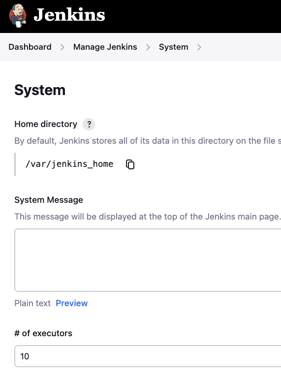
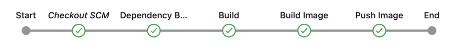
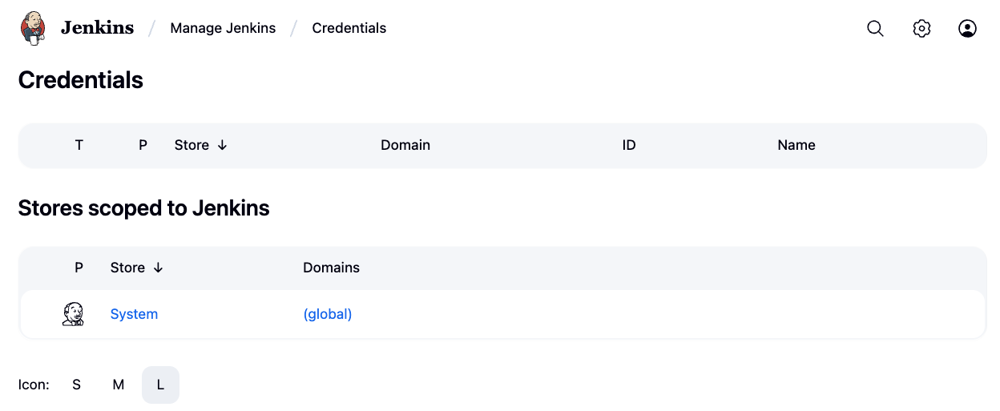
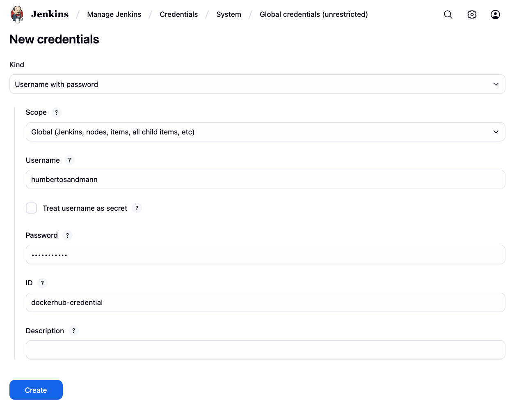

Jenkis is a continuous integration and continuous delivery (CI/CD) tool that automates the process of building, testing, and deploying software. It is widely used in DevOps practices to streamline the software development lifecycle.

## Containerized Jenkins

In this checkpoint, we will set up a Jenkins server using Docker Compose. This will allow us to run Jenkins in a containerized environment, making it easy to manage and deploy.

``` { .tree .copy .select }
api/
jenkins/
    compose.yaml
```

??? info "Source"

    === "compose.yaml"

        ``` { .yaml .copy .select linenums="1" }
        --8<-- "https://raw.githubusercontent.com/Insper/platform/refs/heads/main/jenkins/compose.yaml"
        ```

<!-- termynal -->

To run this container:

``` { .bash .copy .select }
docker compose up -d --build
```

``` bash
jenkins/# docker compose up -d --build

[+] Running 2/2
 ✔ jenkins Created              0.1s 
 ✔ Container jenkins Started    0.2s 
```

Jenkins is now running on port 9080. You can access it by navigating to [http://localhost:9080/](http://localhost:9080/){target="_blank"} in your web browser.

## Jenkins Configuration

Once Jenkins is running, you will need to configure it. The first time you access Jenkins, you will be prompted to unlock it using an initial admin password.

!!! warning "Admin"
    Please, to avoid permission issues, run the console as administrator.

Setting the a number of executors to 10 will allow us to run two jobs in parallel. This is useful for speeding up the build process, especially when we have multiple projects or stages that can be executed concurrently.

{width=100%}


## Pipeline

In this checkpoint, we will create a Jenkins pipeline that will build and deploy our application, [Pipeline as Code](https://www.jenkins.io/doc/book/pipeline/pipeline-as-code/){target="_blank"}. The pipeline will be defined in a `Jenkinsfile` located in the root of our project.

{width=100%}

``` { .tree .copy .select }
api/
    account/
        Jenkinsfile
```
??? info "Source"

    === "Jenkinsfile"

        ``` { .groovy .copy .select linenums="1" }
        --8<-- "https://raw.githubusercontent.com/hsandmann/insper.store.account-service/refs/heads/main/Jenkinsfile"
        ```

The `Jenkinsfile` defines the stages of our pipeline, including building the application, running tests, and deploying the application - **Pipeline as Code**. Each stage can be customized to fit the needs of your project.
The pipeline can be triggered manually or automatically based on events such as code commits or pull requests. This allows for continuous integration and continuous delivery (CI/CD) of our application.

---

eg.: Pipeline for account-service:

``` { .tree .copy .select }
api/
    account-service/
        Jenkinsfile
```

``` { .groovy .copy .select title="Jenkinsfile" }
pipeline {
    agent any
    environment {
        SERVICE = 'account'
        NAME = "humbertosandmann/${env.SERVICE}"
    }
    stages {
        stage('Dependecies') {
            steps {
                build job: 'account', wait: true
            }
        }
        stage('Build') { 
            steps {
                sh 'mvn -B -DskipTests clean package'
            }
        }      
        stage('Build & Push Image') {
            steps {
                withCredentials([usernamePassword(credentialsId: 'dockerhub-credential', usernameVariable: 'USERNAME', passwordVariable: 'TOKEN')]) {
                    sh "docker login -u $USERNAME -p $TOKEN"
                    sh "docker buildx create --use --platform=linux/arm64,linux/amd64 --node multi-platform-builder-${env.SERVICE} --name multi-platform-builder-${env.SERVICE}"
                    sh "docker buildx build --platform=linux/arm64,linux/amd64 --push --tag ${env.NAME}:latest --tag ${env.NAME}:${env.BUILD_ID} -f Dockerfile ."
                    sh "docker buildx rm --force multi-platform-builder-${env.SERVICE}"
                }
            }
        }
    }
}
```

The pipeline is defined in a declarative syntax, which makes it easy to read and understand. Each stage can contain multiple steps, which are the individual tasks that need to be performed:

1. The `environment` block defines environment variables that can be used throughout the pipeline. In this case, we define the `SERVICE` and `NAME` variables, which are used in the `Build & Push Image` stage.

1. The `Build & Push Image` stage uses the `withCredentials` block to securely access Docker Hub credentials stored in Jenkins. The `docker login` command authenticates with Docker Hub, and the `docker buildx build` command builds and pushes the Docker image to the specified tags.
The `docker buildx` command is used to build multi-platform images, allowing us to create images that can run on different architectures (e.g., ARM and AMD64). The `--platform` flag specifies the target platforms, and the `--push` flag pushes the built image to Docker Hub.

1. The `docker buildx create` command creates a new buildx builder instance, which is used to build multi-platform images. The `--use` flag sets this builder as the default for the current shell session. The `--node` flag specifies the name of the builder node, which is used to identify the builder instance.

1. The `docker buildx rm` command removes the builder instance after the build is complete, freeing up resources.

The pipeline can be triggered manually or automatically based on events such as code commits or pull requests. This allows for continuous integration and continuous delivery (CI/CD) of our application.

For setting up the credentials, you can use the Jenkins UI to create a new credential of type "Username with password". The `credentialsId` used in the pipeline should match the ID of the credential you created.

<!-- {width=100%} -->

{width=100%}

Also, Jenkins could deploy the application to a Docker Compose environment. This can be done by adding a new stage to the pipeline that uses the `docker-compose` command to deploy the application.


[^1]: [Jenkins](https://www.jenkins.io/doc/book/using/){target="_blank"} - Jenkins documentation.