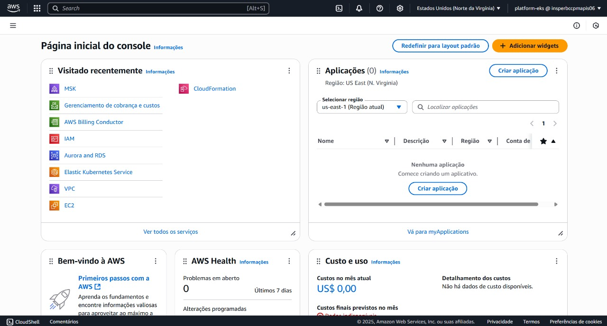

# Configuração da AWS CLI

> Este guia descreve os passos realizados para configurar o acesso à AWS a partir da máquina local, utilizando a **AWS CLI** e uma **chave de acesso IAM**.

---

## 1. Criação do Usuário IAM

No console da AWS:

- Acesse o serviço `IAM`
- Vá até **Usuários** > **Criar usuário**
- Dê permissões apropriadas (por exemplo: `AdministratorAccess`)
- Anote a chave gerada:
  - `Access Key ID`
  - `Secret Access Key`



---

## 2. Geração da Chave de Acesso

Após criar o usuário, uma **chave de acesso** é fornecida.

- Guarde com segurança!
- Necessária para configurar a AWS CLI.

---

## 3. Configuração da AWS CLI

No terminal, execute:

```bash
aws configure
```

Insira as informações solicitadas:

```text
AWS Access Key ID:     <copiado da AWS>
AWS Secret Access Key: <copiado da AWS>
Default region name:   us-east-1
Default output format: json
```

📸 *Print da configuração no terminal*  


---

## 4. Verificação da Configuração

Comando para testar:

```bash
aws sts get-caller-identity
```

Retorno esperado:

```json
{
    "UserId": "AKIA....",
    "Account": "123456789012",
    "Arn": "arn:aws:iam::123456789012:user/platform-eks"
}
```

---

> _Última configuração realizada em 2025-06-03 com sucesso!_
