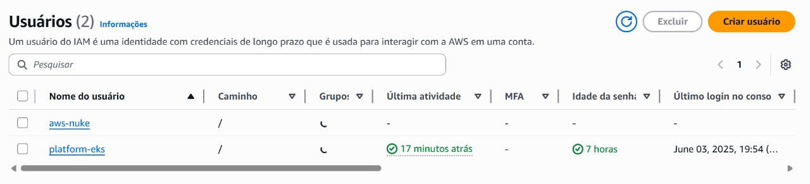
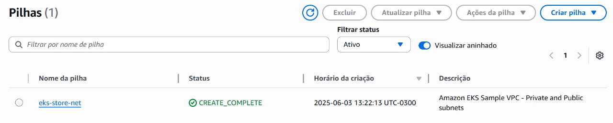
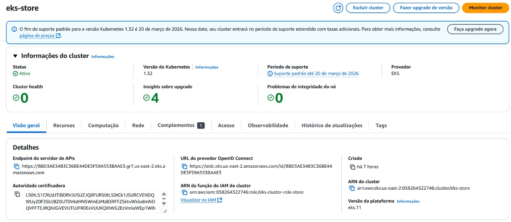
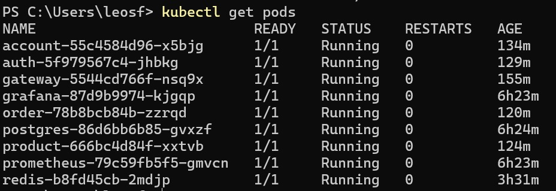
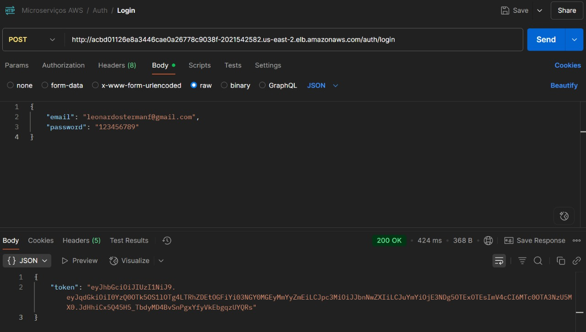

# Configuração do EKS – Amazon Elastic Kubernetes Service

> Este documento apresenta o processo de configuração de infraestrutura usando o **Amazon EKS**.  
> O EKS é o serviço gerenciado da AWS para orquestração de containers com Kubernetes.

## 1. Criação do Papel (IAM Role)

O primeiro passo é criar uma **IAM Role** com permissões de administração para o cluster EKS. Essa role será associada ao cluster para que possa operar os recursos no ambiente.



---

## 2. Criação da VPC com Subnets

Usamos o assistente da AWS CloudFormation para gerar uma **VPC com subnets públicas e privadas**, conforme template oficial da AWS para clusters EKS.



---

## 3. Criação do Cluster EKS

Com a VPC e a Role configuradas, seguimos com a criação do cluster no painel do **EKS**, atribuindo:

- Nome: `eks-store`
- Versão do Kubernetes: `1.32`
- Função (IAM Role): a criada anteriormente
- VPC: a provisionada na etapa anterior




!!! info "Acesso ao Cluster"
    **Passos**  
    Depois disso, acessamos o cluster por meio do aws cli com o seguinte comando:

    ```
    aws eks update-kubeconfig --region us-east-2 --name eks-store, conectando-nos ao cluster
    ```
---

??? example "Criando Kubernetes"
    **k8s**  
    Com o cluster criado, criamos os kubernets de cada microservicos e bottlenecks. 
    Aqui está um exemplo de k8s.yaml:

    ```
        apiVersion: apps/v1
        kind: Deployment
        metadata:
        name: gateway
        spec:
        replicas: 1
        selector:
            matchLabels:
            app: gateway
        template:
            metadata:
            labels:
                app: gateway
            annotations:
                prometheus.io/scrape: "true"
                prometheus.io/port: "8080"
                prometheus.io/path: "/actuator/prometheus"
            spec:
        containers:
        - name: gateway
          image: leosfreitas/gateway:latest
          imagePullPolicy: Always
          ports:
            - containerPort: 8080
          resources:
            requests:
              memory: "200Mi"
              cpu: "50m"
            limits:
              memory: "300Mi"
              cpu: "200m"

        apiVersion: v1
        kind: Service
        metadata:
        name: gateway
        labels:
            app: gateway
        spec:
        type: LoadBalancer
        ports:
            - port: 80
            protocol: TCP
            targetPort: 8080
        selector:
            app: gateway
    ```

??? example "Kubernetes Criados"

    

??? example "Exemplo de requisição para a máquina."

    

---
## Status Final

| Recurso        | Status       |
|----------------|--------------|
| IAM Role       | ✅ Criado e associado |
| VPC/Subnets    | ✅ Criado via CloudFormation |
| Cluster EKS    | ✅ Ativo e saudável |

---

> _Última atualização: 2025-06-03_