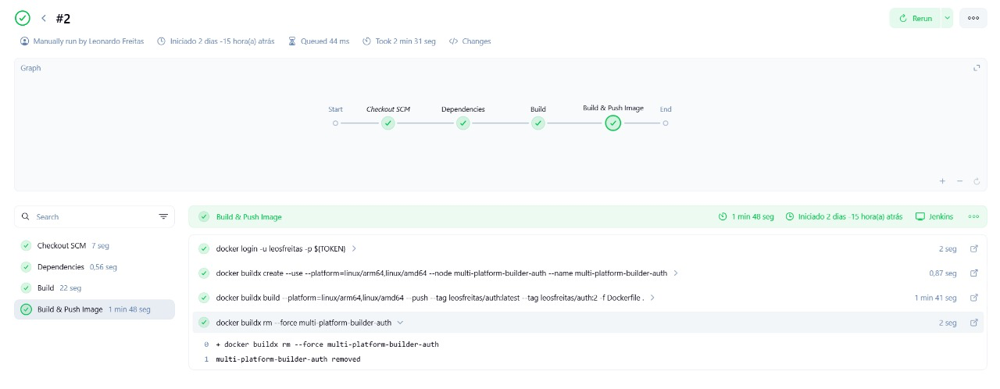

# Jenkins – CI/CD da Plataforma

> Este documento descreve a configuração da pipeline Jenkins para build, push e deploy dos microsserviços da plataforma.  
> Também detalha o endpoint `/info` do **Gateway**, usado para debug e verificação de ambiente em tempo de execução.

---

##  Pipeline Jenkins

### Jenkinsfile (exemplo do `account-service`)

```groovy
pipeline {
    agent any
    environment {
        SERVICE = 'account'
        NAME = "humbertosandmann/${env.SERVICE}"
    }
    stages {
        stage('Dependências') {
            steps {
                build job: 'account', wait: true
            }
        }
        stage('Build') { 
            steps {
                sh 'mvn -B -DskipTests clean package'
            }
        }      
        stage('Build & Push Image') {
            steps {
                withCredentials([usernamePassword(
                    credentialsId: 'dockerhub-credential',
                    usernameVariable: 'USERNAME',
                    passwordVariable: 'TOKEN')])
                {
                    sh "docker login -u $USERNAME -p $TOKEN"
                    sh "docker buildx create --use --platform=linux/arm64,linux/amd64 --node multi-platform-builder-${env.SERVICE} --name multi-platform-builder-${env.SERVICE}"
                    sh "docker buildx build --platform=linux/arm64,linux/amd64 --push --tag ${env.NAME}:latest --tag ${env.NAME}:${env.BUILD_ID} -f Dockerfile ."
                    sh "docker buildx rm --force multi-platform-builder-${env.SERVICE}"
                }
            }
        }
    }
}
```

!!! info "Console Jenkins"
    

---

##  Credenciais & Ambiente

| Chave | Tipo | Onde usar |
|-------|------|-----------|
| `dockerhub-credential` | `usernamePassword` | Usado no stage de push da imagem |
| `.env` | Arquivo com variáveis | Utilizado para definir secrets e configs nos microsserviços |

---

##  Serviços com Jenkinsfile

Todos os microsserviços a seguir possuem um `Jenkinsfile` próprio:

- `account-service`
- `auth-service`
- `gateway-service`
- `product-service`
- `order-service`

---

##  Teste de Ambiente via `/info` – Gateway

### Endpoint

```http
GET /info
```

### Exemplo de resposta `200 OK`

```json
{
  "hostname": "minikube",
  "os.arch": "amd64",
  "os.name": "Linux",
  "os.version": "5.15.0",
  "java.version": "17.0.8"
}
```

!!! tip "Utilização"
    - Validar o ambiente de execução do gateway  
    - Verificar arquitetura, versão do Java e path do `.jar`  
    - Diagnóstico de problemas em builds de produção

!!! info "Rota Funcionando"
    

---

##  Deploy

Cada imagem gerada é publicada no Docker Hub e posteriormente usada nos manifestos do Kubernetes local (Minikube ou Kind) ou em nuvem.

| Etapa | Ferramenta |
|-------|------------|
| Build & push | Jenkins + Docker Buildx |
| Deploy | Kubectl + Jenkins Job ou manual |
| Monitoramento | `/info` + Prometheus |

---

> _Última atualização da pipeline: 2025-06-03_
