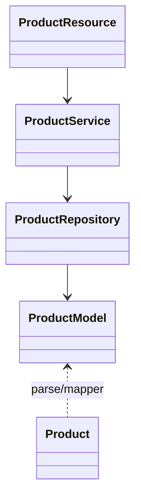

# Product API – Endpoints

> Interface REST do microsserviço **product**, implementada com **Feign** para uso interno entre microsserviços.  
> Todos os endpoints abaixo estão disponíveis em `/product`.

---

##  Product Service

!!! info "Microsserviço Product"
    **Contexto**  
    Este microsserviço expõe recursos REST para **cadastro** e **consulta** de produtos de uma loja.  
    Ele é consumido exclusivamente pelo *Gateway* e requer um **JWT** válido via:

    ```http
    Authorization: Bearer <token>
    ```

| Stack        | Detalhes                                   |
|--------------|---------------------------------------------|
| Linguagem    | Java 17                                     |
| Framework    | Spring Boot 3 + Spring Web                  |
| Persistência | Spring Data JPA → PostgreSQL (`schema product`) |
| Migração     | Flyway (`db/migration`)                     |
| Cache        | Spring Cache + Redis                        |
| Build        | Maven + Docker multi-stage                  |

---

##  Arquitetura



---

##  POST `/product` – Criar Produto

??? example "Requisição"
    ```http
    POST /product
    Content-Type: application/json

    {
      "name": "Tomato",
      "price": 10.12,
      "unit": "kg"
    }
    ```

??? success "Resposta `200 OK`"
    ```json
    {
      "id": "0195abfb-7074-73a9-9d26-b4b9fbaab0a8",
      "name": "Tomato",
      "price": 10.12,
      "unit": "kg"
    }
    ```

!!! tip "Print"
    

---

##  GET `/product` – Listar Produtos

??? example "Requisição"
    ```http
    GET /product
    ```

??? success "Resposta `200 OK`"
    ```json
    [
      {
        "id": "0195abfb-7074-73a9-9d26-b4b9fbaab0a8",
        "name": "Tomato",
        "price": 10.12,
        "unit": "kg"
      },
      {
        "id": "0195abfe-e416-7052-be3b-27cdaf12a984",
        "name": "Cheese",
        "price": 0.62,
        "unit": "slice"
      }
    ]
    ```

!!! tip "Print"
    

---

##  GET `/product/{id}` – Buscar por ID

??? example "Requisição"
    ```http
    GET /product/0195abfb-7074-73a9-9d26-b4b9fbaab0a8
    ```

??? success "Resposta `200 OK`"
    ```json
    {
      "id": "0195abfb-7074-73a9-9d26-b4b9fbaab0a8",
      "name": "Tomato",
      "price": 10.12,
      "unit": "kg"
    }
    ```

!!! tip "Print"
    

---

##  DELETE `/product/{id}` – Remover Produto

??? example "Requisição"
    ```http
    DELETE /product/0195abfb-7074-73a9-9d26-b4b9fbaab0a8
    ```

??? success "Resposta `204 No Content`"
    Sem corpo.

!!! tip "Print"
    

---

##  GET `/product/whoami` – Debug

??? example "Requisição"
    ```http
    GET /product/whoami
    id-product: 0195abfb-7074-73a9-9d26-b4b9fbaab0a8
    ```

??? success "Resposta `200 OK`"
    ```json
    {
      "id": "0195abfb-7074-73a9-9d26-b4b9fbaab0a8",
      "name": "Tomato",
      "price": 10.12,
      "unit": "kg"
    }
    ```

!!! tip "Print"
    (Adicionar imagem aqui)

---

##  Autenticação

!!! warning "JWT obrigatório"
    Todas as chamadas devem conter o token JWT no header:

    ```http
    Authorization: Bearer <token>
    ```

---

> _Última atualização: `ProductController.java`_
